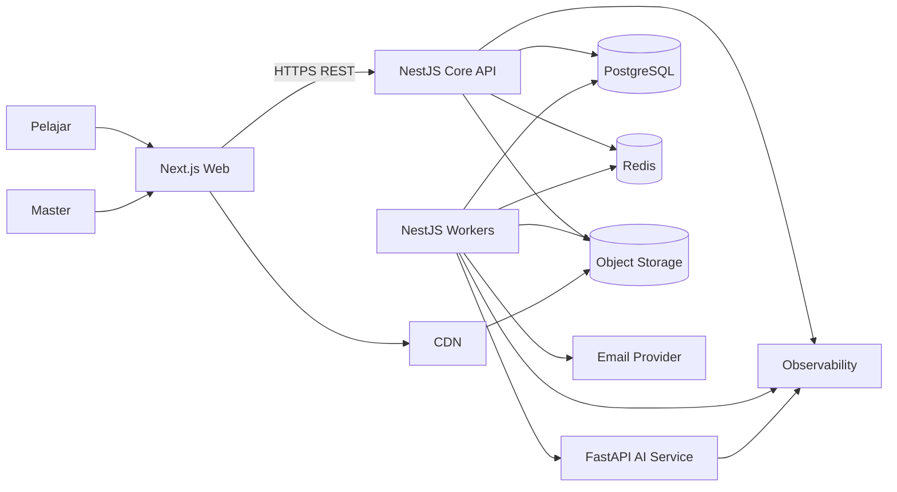
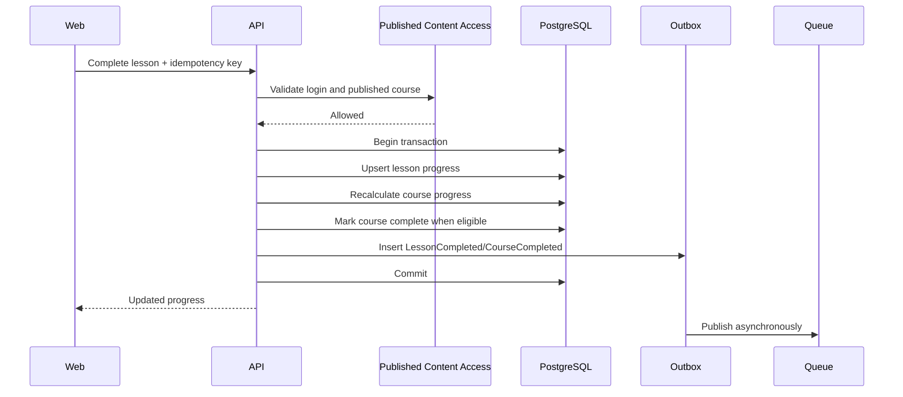

# Software Architecture Document

## LMS AI, Coding, Business, Marketing, and Career

| Informasi | Detail |
|---|---|
| Versi | 2.0 |
| Status | Approved Baseline |
| Gaya Arsitektur | Modular Monolith, Event-Driven, Cloud-Agnostic |
| Frontend | Next.js, React, TypeScript |
| Backend | NestJS, TypeScript |
| AI Service | Python dan FastAPI, hanya untuk kebutuhan AI |
| Database Utama | PostgreSQL |
| ORM | Prisma |
| Cache dan Queue | Redis dan BullMQ |
| File Storage | S3-compatible object storage |
| API | REST `/api/v1`, OpenAPI |
| Deployment | Docker; setiap runtime dapat di-scale terpisah |
| Prioritas | Skalabilitas, maintainability, keamanan, reliability |

---

## 1. Executive Summary

LMS dibangun menggunakan satu monorepo dengan empat runtime yang terpisah:

1. **Web App** — Next.js untuk antarmuka Master dan Pelajar.
2. **Core API** — NestJS modular monolith untuk seluruh business rule utama.
3. **Background Worker** — NestJS standalone application untuk queue.
4. **AI Service** — FastAPI opsional untuk inference, recommendation, skill-gap analysis, dan fitur AI lain.

Core LMS tidak langsung dipecah menjadi microservices. Course, enrollment, access, lesson progress, dan course completion membutuhkan konsistensi transaksi yang kuat. Memisahkannya terlalu cepat akan meningkatkan kompleksitas tanpa manfaat yang sebanding.

Skalabilitas dicapai melalui:

- Web dan API yang stateless.
- Horizontal scaling di belakang load balancer.
- Redis untuk cache, rate limit, session tertentu, dan queue.
- Worker terpisah per workload.
- Object storage dan CDN untuk file.
- Transactional outbox untuk event yang andal.
- Read model dan tabel agregasi untuk analytics.
- PostgreSQL read replica ketika diperlukan.
- Service extraction hanya berdasarkan bottleneck yang terbukti.

---

## 2. Architecture Goals

### 2.1 Skalabilitas

Sistem harus dapat bertumbuh dari satu server menjadi beberapa instance tanpa rewrite besar.

Target desain awal:

- 100.000 akun terdaftar.
- 10.000 daily active learners.
- 2.000 concurrent users.
- Jutaan learning events per bulan.
- Penambahan web, API, dan worker replica secara independen.

Target ini harus divalidasi melalui load test.

### 2.2 Maintainability

- Domain mempunyai ownership yang jelas.
- Business rule tidak tersebar di controller.
- Frontend tidak menjadi sumber kebenaran permission atau progress.
- Kontrak API terdokumentasi dan terversi.
- Circular dependency dicegah melalui architecture test.
- Perubahan penting memiliki Architecture Decision Record.

### 2.3 Security

- Default deny.
- Least privilege.
- Server-side authorization.
- Secure session dan token handling.
- MFA untuk Master.
- Private object storage.
- Signed URL.
- Audit log.
- Rate limiting.
- Secret management.
- Security test pada CI.

### 2.4 Reliability

- Core transaction tidak bergantung pada email, analytics, atau AI.
- Queue consumer idempotent.
- Retry menggunakan exponential backoff.
- Failed job dapat diperiksa dan dijalankan ulang.
- Backup dan restore diuji.
- Health check tersedia.

---

## 3. Selected Technology Stack

## 3.1 Monorepo

Gunakan:

```text
pnpm workspaces
Turborepo
```

Tujuan monorepo:

- Satu tempat untuk web, API, worker, dan shared tooling.
- CI dapat menjalankan task berdasarkan perubahan.
- API client dan design system dapat digunakan ulang.
- Subagent memiliki batas folder yang jelas.

Monorepo tidak berarti seluruh aplikasi harus di-deploy bersama.

## 3.2 Frontend

```text
Next.js
React
TypeScript
TanStack Query
React Hook Form
Zod untuk validasi form di client
```

Next.js bertanggung jawab atas:

- Rendering halaman.
- Routing.
- Authentication-aware UI.
- Dashboard Master.
- Dashboard Pelajar.
- Course builder.
- Learning page.
- Forum.
- Analytics visualisation.

Frontend mengakses Core API melalui generated client berdasarkan OpenAPI.

## 3.3 Backend

```text
NestJS
TypeScript
Prisma
PostgreSQL
```

NestJS bertanggung jawab atas:

- Authentication.
- Authorization.
- User management.
- Learning catalog.
- Enrollment.
- Learning delivery.
- Learning progress.
- Community.
- Notification.
- Analytics orchestration.
- Reporting.
- Audit.

## 3.4 Worker

NestJS standalone worker menjalankan:

- Transactional outbox publishing.
- Notification delivery.
- Email.
- Analytics aggregation.
- Risk scoring.
- Report generation.
- File scanning dan processing.
- Search indexing.
- AI job orchestration.

## 3.5 AI Service

FastAPI digunakan hanya untuk workload AI, misalnya:

- Course recommendation.
- Skill-gap analysis.
- CV analysis.
- Job-role matching.
- AI tutor.
- Forum summarisation.
- Embedding generation.

AI service bukan sumber kebenaran untuk:

- Permission.
- Enrollment.
- Progress.
- Completion.
- Account status.

## 3.6 Database dan Infrastructure

```text
PostgreSQL
Redis
BullMQ
S3-compatible object storage
CDN
Docker
Nginx atau managed load balancer
OpenTelemetry
```

---

## 4. High-Level System Context



---

## 5. Deployment Units

## 5.1 Web Runtime

```text
apps/web
```

Karakteristik:

- Stateless.
- Dapat ditambah replica.
- Tidak menyimpan file lokal.
- Menggunakan API base URL dari environment.
- Tidak mengakses database secara langsung.

## 5.2 API Runtime

```text
apps/api
```

Karakteristik:

- Stateless.
- Menjalankan business use case synchronously.
- Menulis data authoritative ke PostgreSQL.
- Menulis outbox event dalam transaksi yang sama.
- Tidak menjalankan pekerjaan berat.

## 5.3 Worker Runtime

```text
apps/worker
```

Worker groups:

```text
worker-critical
worker-notifications
worker-analytics
worker-reports
worker-media
worker-ai
```

Setiap group dapat memiliki jumlah replica berbeda.

## 5.4 AI Runtime

```text
apps/ai-service
```

Karakteristik:

- Dapat diaktifkan setelah core LMS stabil.
- Tidak dapat mengakses database production secara bebas.
- Memperoleh input melalui contract yang telah disanitasi.
- Response AI divalidasi sebelum disimpan atau ditampilkan.

---

## 6. Monorepo Structure

```text
lms-platform/
├── apps/
│   ├── web/
│   │   ├── app/
│   │   ├── features/
│   │   ├── components/
│   │   ├── lib/
│   │   ├── hooks/
│   │   ├── tests/
│   │   └── public/
│   │
│   ├── api/
│   │   ├── src/
│   │   │   ├── modules/
│   │   │   ├── shared/
│   │   │   ├── infrastructure/
│   │   │   ├── config/
│   │   │   └── main.ts
│   │   ├── prisma/
│   │   └── test/
│   │
│   ├── worker/
│   │   ├── src/
│   │   │   ├── processors/
│   │   │   ├── schedulers/
│   │   │   ├── consumers/
│   │   │   └── main.ts
│   │   └── test/
│   │
│   └── ai-service/
│       ├── app/
│       ├── models/
│       ├── services/
│       ├── schemas/
│       └── tests/
│
├── packages/
│   ├── api-client/
│   ├── ui/
│   ├── config-eslint/
│   ├── config-typescript/
│   ├── observability/
│   └── testing/
│
├── docs/
│   ├── PRD.md
│   ├── architecture/
│   ├── api/
│   ├── database/
│   ├── security/
│   ├── operations/
│   ├── testing/
│   ├── roadmap/
│   └── decisions/
│
├── infra/
│   ├── docker/
│   ├── nginx/
│   ├── scripts/
│   └── terraform/
│
├── .github/
│   └── workflows/
├── AGENTS.md
├── CLAUDE.md
├── package.json
├── pnpm-workspace.yaml
└── turbo.json
```

---

## 7. Core API Module Structure

```text
apps/api/src/modules/
├── identity/
├── users/
├── learning-profile/
├── learning-catalog/
├── enrollment/
├── learning-delivery/
├── learning-progress/
├── quiz/
├── community/
├── communication/
├── analytics/
├── reporting/
├── media/
└── audit/
```

Struktur setiap module:

```text
module-name/
├── domain/
│   ├── entities/
│   ├── value-objects/
│   ├── events/
│   ├── enums/
│   └── errors/
│
├── application/
│   ├── commands/
│   ├── queries/
│   ├── dto/
│   ├── ports/
│   └── services/
│
├── infrastructure/
│   ├── persistence/
│   ├── adapters/
│   ├── mappers/
│   └── integrations/
│
├── presentation/
│   ├── controllers/
│   ├── guards/
│   ├── decorators/
│   └── serializers/
│
├── tests/
└── module.ts
```

### Dependency Direction

```text
presentation
    ↓
application
    ↓
domain

infrastructure → application ports
```

Domain tidak boleh bergantung pada:

- NestJS controller.
- Prisma client.
- Redis.
- HTTP request.
- External provider.

---

## 8. Domain Ownership

## 8.1 Identity

Memiliki:

- Credential.
- Login.
- Refresh session.
- Password reset.
- MFA.
- Account lock.
- Session revocation.

## 8.2 Users

Memiliki:

- User profile administratif.
- Account status.
- Role assignment.
- Master user management.

## 8.3 Learning Profile

Memiliki:

- Learning goal.
- Experience level.
- Work background.
- Weekly study capacity.
- Target skill.
- Target learning path.

## 8.4 Learning Catalog

Memiliki:

- Learning path.
- Course.
- Module.
- Lesson.
- Category.
- Publishing state.
- Prerequisite metadata.

## 8.5 Enrollment

Memiliki:

- User-course membership.
- Access start dan end.
- Enrollment status.
- Access validation.

## 8.6 Learning Delivery

Memiliki:

- Course outline untuk Pelajar.
- Lesson delivery.
- Previous dan next lesson.
- Material signed access.
- Prerequisite evaluation.

## 8.7 Learning Progress

Memiliki:

- Lesson progress.
- Course progress.
- Continue learning.
- Completion.
- Learning history.

## 8.7a Quiz

Memiliki:

- Penyusunan soal dan kunci jawaban.
- Penilaian pengiriman jawaban.
- Batas percobaan.

Berdiri sebagai module tersendiri, bukan bagian dari learning-catalog, karena
ia memegang dua hal yang tidak dimiliki katalog: kunci jawaban yang harus
dijaga agar tidak ikut terkirim, dan penilaian yang menentukan penyelesaian
pelajaran. Untuk menandai pelajaran selesai ia memanggil application service
milik learning-progress, bukan menulis langsung ke tabel progres.

## 8.8 Community

Memiliki:

- Discussion.
- Reply.
- Reaction.
- Report.
- Moderation.
- Best answer.

## 8.9 Communication

Memiliki:

- Announcement.
- In-app notification.
- Notification preference.
- Delivery status.

## 8.10 Analytics

Memiliki:

- Raw learning event.
- Daily aggregate.
- Drop-off.
- Risk score.
- Segment insight.
- Dashboard read model.

## 8.11 Reporting

Memiliki:

- Export request.
- Report generation.
- Report file.
- Export lifecycle.

## 8.12 Media

Memiliki:

- File metadata.
- Upload permission.
- Scan status.
- Signed URL.
- Storage lifecycle.

## 8.13 Audit

Memiliki:

- Administrative audit.
- Security event.
- Privileged action history.

---

## 9. Cross-Module Communication

## 9.1 Synchronous Interaction

Gunakan application port apabila hasil dibutuhkan dalam request yang sama.

Contoh:

- Progress meminta Enrollment menyiapkan wadah progres untuk pengguna terautentikasi.
- Delivery meminta Catalog memastikan lesson published.
- Reporting meminta Authorization memastikan export diperbolehkan.

## 9.2 Asynchronous Interaction

Gunakan domain event untuk side effect:

```text
LessonCompleted
CourseCompleted
DiscussionReported
AnnouncementPublished
UserRiskLevelChanged
```

Consumer:

- Notification.
- Analytics.
- Email.
- Audit tertentu.
- Search indexing.

## 9.3 Forbidden Pattern

Tidak diperbolehkan:

- Controller module A mengakses Prisma model module B secara langsung.
- Frontend menghitung progress authoritative.
- Worker mengubah state core tanpa use case resmi.
- AI service mengubah permission atau completion.
- Module membaca private repository module lain.

---

## 10. API Architecture

Gunakan REST API:

```text
/api/v1
```

Alasan:

- Mudah dipahami.
- Mudah diuji.
- Cocok untuk web dan future mobile.
- OpenAPI dapat menghasilkan typed client.
- Access control lebih eksplisit.

### Contract Workflow

```text
NestJS DTO dan OpenAPI
        ↓
OpenAPI specification
        ↓
Generated TypeScript API client
        ↓
Next.js Web
```

Frontend tidak mengimpor entity backend secara langsung.

---

## 11. Authentication Architecture

## 11.1 Web Authentication

Rekomendasi:

- Short-lived access token disimpan dalam `HttpOnly Secure cookie`.
- Rotating refresh token disimpan dalam `HttpOnly Secure cookie`.
- Refresh token disimpan dalam bentuk hash pada database.
- CSRF protection untuk endpoint berbasis cookie.
- Token tidak disimpan di localStorage.
- Session/device list tersedia.
- Logout mencabut refresh session.

Alternatif yang lebih sederhana untuk deployment satu domain adalah opaque server session di Redis. Pilihan final dicatat dalam ADR setelah pola domain dan deployment ditetapkan.

## 11.2 Master Security

- MFA wajib.
- Recent authentication untuk tindakan sensitif.
- Rate limit lebih ketat untuk login dan reset password.
- Audit pada export, user suspension, role change, dan content deletion.

## 11.3 Password

- Gunakan password hashing yang kuat.
- Password reset token single-use.
- Reset token memiliki expiration.
- Tidak pernah menyimpan atau menulis password ke log.

---

## 12. Authorization Architecture

Tiga lapisan:

### 12.1 Role dan Permission

Contoh:

```text
users.read
users.manage
courses.read
courses.manage
enrollments.manage
analytics.read
discussions.moderate
reports.export
audit.read
```

### 12.2 Resource Policy

Memvalidasi:

- Kepemilikan.
- Sesi pengguna terautentikasi.
- Publishing status.
- Discussion ownership.
- Master permission.

### 12.3 Scoped Query

Database query harus dibatasi berdasarkan hak akses.

Contoh:

- Pengguna terautentikasi hanya mengambil course berstatus published pada permukaan pelajar.
- Enrollment dibuat atau diaktifkan otomatis sebagai wadah progres, bukan sebagai authorization gate.
- Pelajar hanya mengambil notification miliknya.
- Master analytics hanya mengambil data scope akademi.

Default adalah deny untuk pengguna tanpa sesi, resource yang tidak diterbitkan, dan tindakan administratif tanpa permission.

---

## 13. Progress Transaction

Lesson completion adalah critical transaction.



Rules:

- Unique constraint pada user dan lesson.
- Request completion idempotent.
- Course progress tidak boleh lebih dari 100%.
- Materi opsional tidak memengaruhi progress utama.
- Notification dan analytics tidak memblokir completion.

---

## 14. Transactional Outbox

Table `outbox_messages` ditulis dalam transaksi yang sama dengan business data.

Field:

```text
id
event_id
event_type
aggregate_type
aggregate_id
payload
schema_version
occurred_at
available_at
processed_at
attempts
last_error
```

Publisher:

1. Mengambil event belum diproses.
2. Mengunci batch.
3. Mengirim job ke BullMQ.
4. Menandai event telah dipublikasikan.
5. Retry jika gagal.

Consumer wajib idempotent berdasarkan `event_id`.

---

## 15. Queue Architecture

Queue:

```text
critical
notifications
analytics
reports
media
ai
maintenance
```

### Critical

- Outbox publishing.
- Access expiration yang harus tepat.
- Core reconciliation.

### Notifications

- In-app notification.
- Email delivery.

### Analytics

- Event aggregation.
- Risk scoring.
- Drop-off calculation.

### Reports

- CSV.
- Excel dan PDF pada fase lanjutan.

### Media

- Malware scan.
- Image optimisation.
- Document metadata extraction.

### AI

- Recommendation.
- Skill-gap analysis.
- Summarisation.
- Embedding.

Setiap job memiliki:

- Timeout.
- Retry policy.
- Backoff.
- Idempotency.
- Trace ID.
- Failed job handling.

---

## 16. Analytics Architecture

```text
Core business event
    ↓
Outbox
    ↓
BullMQ
    ↓
Raw learning event
    ↓
Aggregation worker
    ↓
Daily and snapshot read models
    ↓
Master analytics API
```

Tabel utama:

```text
learning_events
analytics_user_daily
analytics_course_daily
analytics_lesson_daily
analytics_segment_daily
analytics_risk_snapshots
analytics_dropoff_snapshots
```

Dashboard tidak menghitung jutaan raw event pada setiap request.

### Strong Consistency

- Enrollment.
- Lesson completion.
- Course progress.
- Permission.

### Eventual Consistency

- Analytics.
- Notification.
- Email.
- Search.
- Risk score.
- Report.

---

## 17. Database Architecture

## 17.1 PostgreSQL as System of Record

Semua authoritative data berada di PostgreSQL.

Gunakan:

- Foreign key.
- Unique constraint.
- Check constraint.
- Transaction.
- UTC timestamp.
- Soft delete hanya jika diperlukan.
- JSONB hanya untuk metadata fleksibel, bukan menggantikan struktur relasional.

## 17.2 Prisma

Prisma digunakan untuk:

- Type-safe data access.
- Migration.
- Transaction.
- Query.

Untuk query analytics yang kompleks, raw SQL terkontrol diperbolehkan melalui query object dengan test.

## 17.3 Scale Strategy

Urutan scaling:

1. Optimasi query.
2. Index.
3. Hilangkan N+1.
4. Cache.
5. Precomputed read model.
6. Connection pooling.
7. Read replica.
8. Partition high-volume event table.
9. Pisahkan analytics database.
10. Sharding hanya bila benar-benar diperlukan.

## 17.4 Partition Candidates

- `learning_events`
- `audit_logs`
- `outbox_messages`
- `notification_deliveries`

Partition baru diterapkan setelah volume dan query pattern tervalidasi.

---

## 18. Cache Architecture

Redis cache digunakan untuk:

- Published course outline.
- Learning path catalogue.
- Permission map.
- Dashboard summary.
- Frequently accessed configuration.

Tidak digunakan sebagai source of truth untuk:

- Progress.
- Enrollment.
- Completion.
- Role assignment.

Rules:

- Versioned cache key.
- TTL.
- Invalidation melalui event.
- Cache stampede protection.
- Session dan queue dipisah secara logical; kemudian physical saat scale.

---

## 19. File and Video Architecture

### Upload Flow

1. Frontend meminta upload intent.
2. API memvalidasi permission, MIME, ukuran, dan tujuan.
3. API memberikan signed upload URL.
4. Frontend upload langsung ke object storage.
5. Frontend mengonfirmasi upload.
6. Worker melakukan scan dan processing.
7. File menjadi available setelah lolos.

Security:

- Private bucket default.
- Signed URL pendek.
- Random object key.
- Allow-list MIME.
- Maximum size.
- Malware scan.
- Tidak ada executable upload.
- Content-Disposition aman.
- Video tidak melewati API server.

---

## 20. AI Service Security

AI service menerima data minimum.

Tidak boleh mengirim:

- Password.
- Token.
- Full session.
- Data pribadi yang tidak dibutuhkan.
- Private discussion tanpa tujuan dan izin yang jelas.
- Database credential.

Output AI:

- Dianggap untrusted.
- Divalidasi schema.
- Tidak dieksekusi langsung.
- Tidak dapat mengubah permission.
- Tidak dapat menyelesaikan course atas nama user.
- Memiliki model dan prompt version.

---

## 21. Observability

Gunakan OpenTelemetry.

### Logs

- JSON structured log.
- Request ID.
- Trace ID.
- Environment.
- Service.
- Severity.
- No secret.
- No raw token.

### Metrics

- Request rate.
- Error rate.
- p50, p95, p99 latency.
- Database pool usage.
- Slow query.
- Redis latency.
- Queue depth.
- Oldest job age.
- Failed job.
- Outbox lag.
- Analytics lag.
- AI service latency dan failure.
- File processing failure.

### Traces

- Browser request ke API.
- Database transaction.
- Outbox publish.
- Worker processing.
- External service call.

---

## 22. Deployment Strategy

## 22.1 Initial Production

```text
CDN/WAF
   ↓
Nginx or Load Balancer
   ├── Next.js Web
   ├── NestJS API
   └── NestJS Workers

Managed or isolated:
   ├── PostgreSQL
   ├── Redis
   ├── Object Storage
   └── Email Provider
```

Docker Compose pada VPS dapat digunakan untuk tahap awal.

Shared hosting tidak direkomendasikan.

## 22.2 Growth

- Multiple web replica.
- Multiple API replica.
- Dedicated worker replica.
- Managed PostgreSQL.
- Managed Redis.
- Read replica.
- CDN.
- Central observability.
- Automated backup dan restore test.

## 22.3 High Scale

Managed container platform atau Kubernetes hanya ketika:

- Replica dan worker sudah banyak.
- Autoscaling dibutuhkan.
- Tim memiliki kemampuan operasional.
- Biaya kompleksitas dapat dibenarkan.

---

## 23. CI/CD

Pipeline:

```text
Install
→ Lint
→ Type check
→ Unit test
→ Integration test
→ Architecture test
→ Security scan
→ Build
→ Deploy staging
→ Migration check
→ Smoke test
→ Production approval
→ Deploy production
→ Health verification
```

Wajib:

- Build immutable image.
- Secret scan.
- Dependency scan.
- Prisma migration test.
- OpenAPI compatibility check.
- Generated client up-to-date.
- Rollback procedure.
- Expand-and-contract untuk breaking database change.

---

## 24. Testing Strategy

### Unit Test

- Progress calculation.
- Enrollment state.
- Risk scoring.
- Permission.
- Domain event.

### Integration Test

- PostgreSQL.
- Redis.
- BullMQ.
- Object storage.
- Outbox.

### API Test

- Authentication.
- Authorization.
- Validation.
- Pagination.
- Idempotency.
- Error format.

### End-to-End Test

Critical journey:

1. Master membuat course.
2. Master publish course.
3. Master enroll Pelajar.
4. Pelajar membuka lesson.
5. Pelajar menyelesaikan lesson.
6. Progress berubah.
7. Course completion terjadi.
8. Analytics aggregate ter-update.
9. Master melihat insight.

### Architecture Test

Memastikan:

- Domain tidak import NestJS presentation.
- Module tidak membaca repository private module lain.
- Web tidak mengakses database.
- Worker menggunakan application service resmi.
- Circular dependency tidak ada.

---

## 25. Security Control Baseline

- TLS only.
- WAF dan rate limit.
- Secure headers.
- CSRF untuk cookie auth.
- HttpOnly dan Secure cookie.
- MFA Master.
- Least-privilege database account.
- Private network untuk database dan Redis.
- Secrets di secret manager.
- Signed file access.
- Input validation.
- Output encoding.
- Parameterised query.
- Audit log.
- Dependency scanning.
- Container image scanning.
- Backup encryption.
- Restore drill.
- Security test untuk IDOR.
- Error response tanpa stack trace.

---

## 26. Service Extraction Strategy

Service dipisahkan hanya jika:

- Membutuhkan scale jauh lebih tinggi.
- Membutuhkan deployment independen.
- Memiliki team ownership sendiri.
- Memerlukan failure isolation.
- Contract telah stabil.
- Data consistency boundary dapat diterima.

Kandidat extraction:

1. AI service — sudah terpisah karena runtime berbeda.
2. Analytics.
3. Notification.
4. Media processing.
5. Search.
6. Reporting.

Enrollment dan progress tetap bersama selama mungkin.

---

## 27. Architecture Decision Records

ADR wajib untuk:

- Monorepo.
- NestJS modular monolith.
- Authentication strategy.
- Prisma.
- Transactional outbox.
- BullMQ.
- AI service boundary.
- Deployment provider.
- Analytics extraction.
- Multi-tenant adoption.

---

## 28. Definition of Architecture Ready

Arsitektur siap diimplementasikan jika:

- PRD disetujui.
- Domain module disetujui.
- ERD core disetujui.
- API contract P0 disetujui.
- Authentication strategy dipilih.
- Threat model tersedia.
- Progress transaction disetujui.
- Event taxonomy awal tersedia.
- Deployment awal dipilih.
- Test plan tersedia.
- Tidak ada risiko critical yang belum memiliki mitigasi.

---

## 29. Final Decision

Gunakan:

```text
Next.js + React + TypeScript
NestJS + TypeScript
Python + FastAPI untuk AI
PostgreSQL + Prisma
Redis + BullMQ
S3-compatible Object Storage
Docker
OpenAPI
OpenTelemetry
```

Dengan pola:

```text
Monorepo
+ NestJS Modular Monolith
+ Transactional Outbox
+ Independent Queue Workers
+ Analytics Read Models
+ Optional Python AI Service
+ Stateless Horizontal Scaling
```

Pola ini memberikan keseimbangan terbaik antara kecepatan development, skalabilitas, keamanan, dan kemudahan maintenance.

## 30. Bunny Stream Video Architecture

Bunny Stream menjadi provider video utama untuk MVP melalui abstraction:

```text
VideoProviderPort
└── BunnyStreamAdapter
```

Bunny Stream menangani penyimpanan, direct upload, transcoding, adaptive streaming, CDN, Token Authentication, Allowed Domains, MediaCage Basic DRM, serta processing webhook.

NestJS tetap menangani permission upload, validasi sesi dan status publikasi, lesson access, playback session, token generation, webhook verification, metadata, audit, dan security event.

### Upload Flow

```text
Master Browser
→ NestJS membuat video object dan upload credential
→ Browser upload langsung ke Bunny Stream
→ Bunny melakukan transcoding dan proteksi
→ Bunny webhook mengirim status
→ NestJS memperbarui VIDEO_ASSETS
```

### Playback Flow

```text
Student meminta playback session
→ NestJS memvalidasi account, status publikasi course, lesson, dan prerequisite
→ NestJS membuat token singkat
→ Player memutar DRM-protected stream
```

### Security Baseline

- MediaCage Basic DRM aktif untuk video terlindungi.
- Token Authentication aktif dengan TTL default 300 detik.
- Allowed Domains dibatasi ke domain LMS.
- Tidak ada permanent public playback URL.
- API key dan token key hanya tersedia di backend.
- Playback token tidak dicatat pada log.
- Sesuai ADR-027, player tidak menampilkan watermark identitas; signed playback dan session access tetap diwajibkan.
- Concurrent playback dapat dibatasi.
- Video tidak di-stream melalui NestJS.
- DRM mengurangi download tidak sah, tetapi tidak dapat mencegah kamera atau screen recording sepenuhnya.
