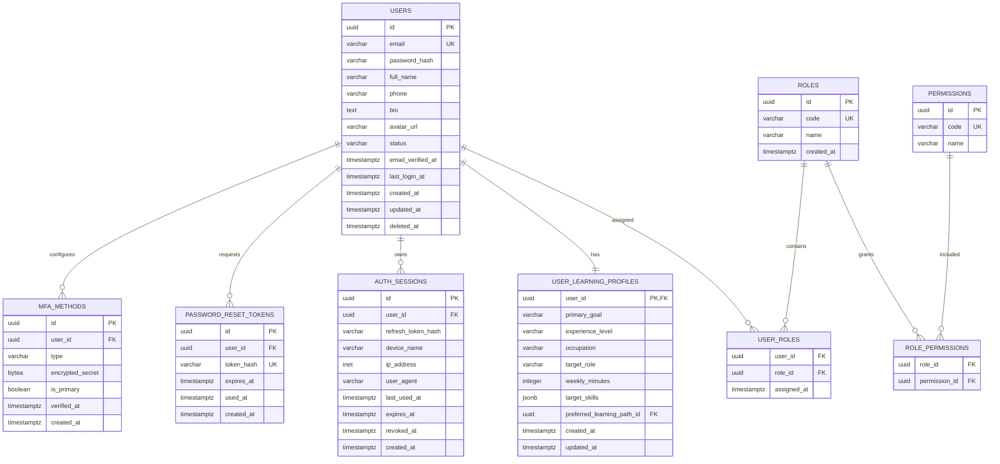
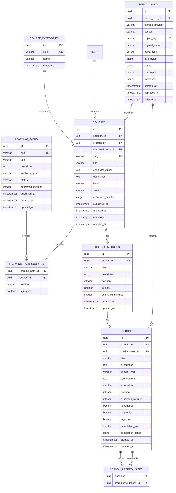
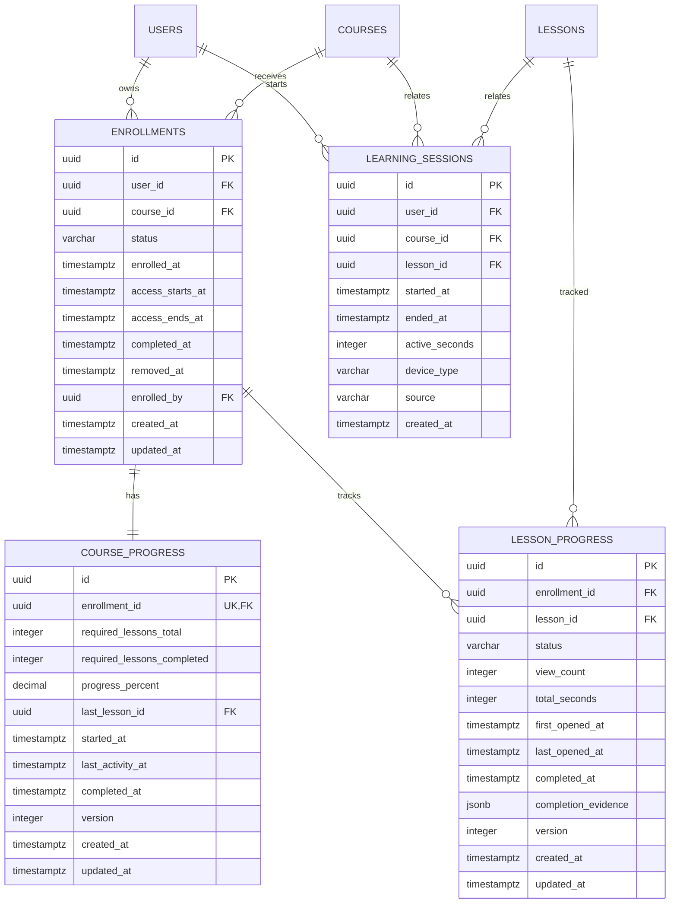
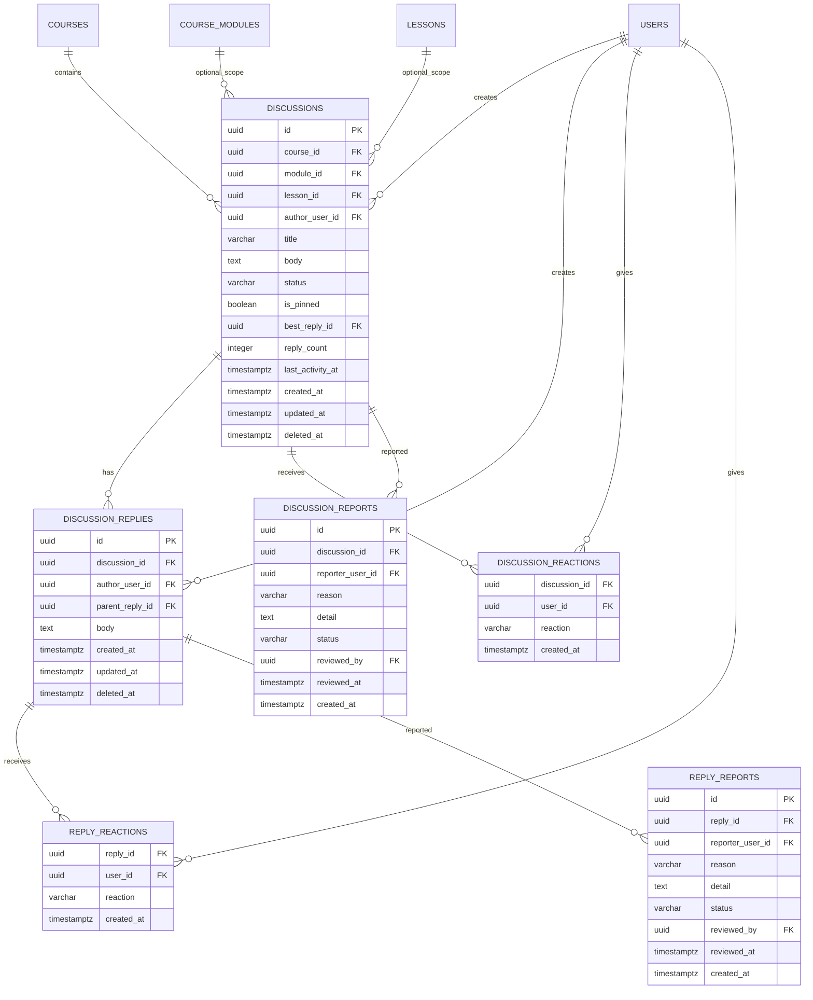
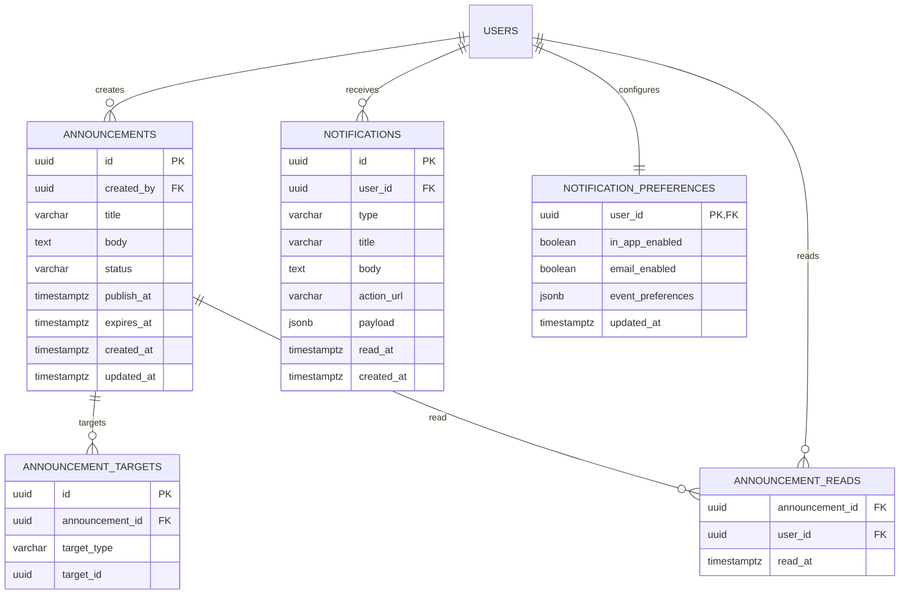
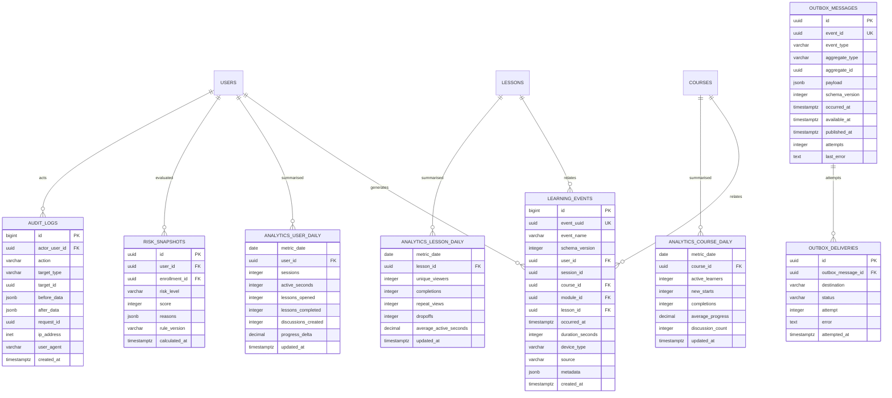
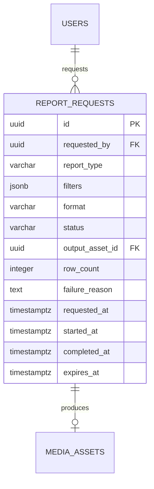

# Entity Relationship Design

## LMS Database Design v1.0

Dokumen ini mendefinisikan data model logical untuk MVP. Implementasi fisik menggunakan PostgreSQL dan Prisma.

---

## 1. Design Principles

- PostgreSQL menjadi system of record.
- Semua relation penting memiliki foreign key.
- Email dan identifier publik harus unik.
- Data historis progress tidak dihapus ketika account atau enrollment dinonaktifkan.
- Event dan audit bersifat append-only secara application behaviour.
- Semua waktu disimpan dalam UTC.
- Entity publik menggunakan UUID.
- Table analytics merupakan derived data dan dapat dibangun ulang dari event.
- JSONB hanya digunakan untuk metadata yang terkontrol.
- PII tidak dimasukkan ke metadata event tanpa kebutuhan eksplisit.

---

## 2. Core Identity ERD



### Constraints

- `users.email` unique dan case-insensitive.
- MVP membatasi satu active role per user melalui unique `user_roles.user_id`.
- `status`: `ACTIVE`, `INACTIVE`, `SUSPENDED`.
- Refresh token hanya disimpan dalam bentuk hash.
- MFA diwajibkan oleh business rule untuk role Master.

---

## 3. Learning Catalog ERD



### Status

`learning_paths.status`:

- `DRAFT`
- `PUBLISHED`
- `ARCHIVED`

`courses.status`:

- `DRAFT`
- `PUBLISHED`
- `ARCHIVED`

`media_assets.status`:

- `UPLOADING`
- `PENDING_SCAN`
- `AVAILABLE`
- `REJECTED`
- `DELETED`

---

## 4. Enrollment and Progress ERD



### Constraints

- Unique `enrollments(user_id, course_id)` untuk enrollment aktif secara logical.
- Unique `lesson_progress(enrollment_id, lesson_id)`.
- `course_progress.progress_percent` antara 0 dan 100.
- `required_lessons_completed <= required_lessons_total`.
- Optimistic version tersedia untuk mencegah lost update.
- Histori tetap ada ketika enrollment berstatus `REMOVED` atau `EXPIRED`.

---

## 5. Community ERD



### Constraints

- Pelajar hanya dapat membuat discussion dalam course yang diikuti.
- Unique reaction per user dan target.
- `best_reply_id` harus berasal dari discussion yang sama.
- Soft delete digunakan untuk moderation dan audit.

---

## 6. Communication ERD



`announcement_targets.target_type`:

- `ALL_USERS`
- `COURSE`
- `USER`
- `LEARNING_PATH`
- `AUDIENCE_SEGMENT`

Target polymorphic ini dikelola melalui application validation karena target dapat berasal dari beberapa aggregate.

---

## 7. Analytics and Audit ERD



### Index Utama

`learning_events`:

- Unique `event_uuid`.
- `(user_id, occurred_at desc)`.
- `(course_id, occurred_at desc)`.
- `(lesson_id, occurred_at desc)`.
- `(event_name, occurred_at desc)`.

`outbox_messages`:

- Partial index pada `published_at is null`.
- `(available_at, occurred_at)` untuk publisher.

`risk_snapshots`:

- `(risk_level, calculated_at desc)`.
- `(enrollment_id, calculated_at desc)`.

---

## 8. Reporting ERD



Status:

- `QUEUED`
- `PROCESSING`
- `COMPLETED`
- `FAILED`
- `EXPIRED`

---

## 9. Recommended Deletion Behaviour

| Entity | Behaviour |
|---|---|
| User | Suspend terlebih dahulu; anonymisation mengikuti retention policy |
| Course | Archive; hard delete hanya sebelum dipakai |
| Module/Lesson | Nonaktifkan; jangan menghapus histori progress |
| Enrollment | Ubah status menjadi Removed |
| Discussion | Soft delete |
| Learning event | Retention atau partition drop berdasarkan kebijakan |
| Audit log | Append-only dan retention khusus |
| Media asset | Mark deleted lalu lifecycle object storage |
| Notification | Dapat dihapus setelah retention |
| Report file | Expire otomatis |

---

## 10. Prisma Migration Rules

- Satu migration untuk satu perubahan logical.
- Migration production harus memiliki rollback plan.
- Rename menggunakan expand-and-contract.
- Kolom mandatory baru dibuat nullable atau memiliki default terlebih dahulu.
- Index besar dibuat dengan strategi yang tidak memblokir jika environment menuntut.
- Data backfill dijalankan sebagai job terkontrol.
- Migration tidak memanggil external API.
- CI menjalankan migration dari database kosong dan database baseline.

---

## 11. ERD Acceptance Criteria

ERD dianggap siap jika:

- Semua entity P0 memiliki table.
- Semua foreign key disetujui.
- Unique constraint enrollment dan progress tersedia.
- Deletion behaviour disetujui.
- Event metadata dan retention dibatasi.
- Index utama memiliki query justification.
- API contract dapat dipetakan ke entity.
- Security reviewer menyetujui penyimpanan credential dan token.
- Analytics engineer menyetujui raw event dan aggregate.

## 12. Video Assets

```text
VIDEO_ASSETS
- id
- lesson_id
- created_by
- provider
- provider_video_id
- object_key
- original_name
- mime_type
- size_bytes
- title
- status
- duration_seconds
- width
- height
- drm_enabled
- drm_type
- thumbnail_url
- processing_error
- created_at
- updated_at
- deleted_at

VIDEO_PLAYBACK_SESSIONS
- id
- video_asset_id
- user_id
- enrollment_id
- device_id
- status
- initial_ip
- started_at
- last_heartbeat_at
- ended_at

VIDEO_PROVIDER_EVENTS
- id
- video_asset_id
- provider_event_id
- event_type
- payload_summary
- received_at
- processed_at
- processing_error
```

Provider enum: `SELF_HOSTED`, `BUNNY_STREAM`.

Video status: `CREATED`, `UPLOADING`, `PROCESSING`, `AVAILABLE`, `FAILED`, `DELETED`.

DRM type: `NONE`, `MEDIACAGE_BASIC`, `MEDIACAGE_ENTERPRISE`.

Playback status: `ACTIVE`, `ENDED`, `EXPIRED`, `REVOKED`.

Constraints:

- Satu active video asset per lesson untuk MVP.
- `provider_video_id` unique.
- `provider_event_id` unique untuk replay protection.
- Playback session selalu terkait active enrollment.
- Playback token dan permanent URL tidak pernah disimpan.
- Provider secrets dan permanent playback URL tidak disimpan di database.
- `object_key` hanya diisi untuk provider self-hosted dan bukan public URL.
